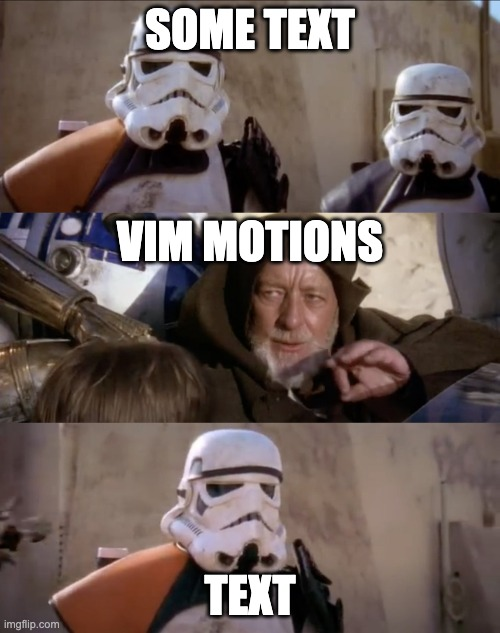

## Jedi-Level Control with Vim Motions

Daniel Lazar - One Identity


---

## What's Vim Motions/Vi/Vim/NeoVim?


===

### Motions

Text navigation and manipulation (magic)



===

### Vi/Vim/NeoVim

These are editors

- Vi: Original
- Vim: Vi IMproved
- NeoVim: Modern fork of Vim


===

### Differences

<table border="1" cellpadding="8" cellspacing="0" class="editors-diffs">
  <thead>
    <tr>
      <th>Feature</th>
      <th>vi (Original)</th>
      <th>Vim (Vi Improved)</th>
      <th>Neovim (Modern Vim Fork)</th>
    </tr>
  </thead>
  <tbody>
    <tr>
      <td><strong>Release Date</strong></td>
      <td>1976</td>
      <td>1991</td>
      <td>2014</td>
    </tr>
    <tr>
      <td><strong>Goal</strong></td>
      <td>Minimal, portable editor</td>
      <td>Enhanced <code>vi</code> with more features</td>
      <td>Modernize and refactor Vim</td>
    </tr>
    <tr>
      <td><strong>Plugin Support</strong></td>
      <td>❌ None</td>
      <td>⚠️ Limited, manual setup</td>
      <td>✅ Built-in plugin manager and Lua support</td>
    </tr>
    <tr>
      <td><strong>UI Features</strong></td>
      <td>❌ None</td>
      <td>⚠️ Limited terminal UI</td>
      <td>✅ Async UI, GUI frontends (e.g. <code>neovide</code>)</td>
    </tr>
    <tr>
      <td><strong>Extensibility</strong></td>
      <td>❌ None</td>
      <td>✅ Via Vimscript</td>
      <td>✅ Lua + Vimscript, better architecture</td>
    </tr>
    <tr>
      <td><strong>Performance</strong></td>
      <td>✅ Very lightweight</td>
      <td>✅ Lightweight</td>
      <td>✅ Optimized, async I/O support</td>
    </tr>
    <tr>
      <td><strong>Community</strong></td>
      <td>⚠️ Legacy users</td>
      <td>✅ Large, still active</td>
      <td>✅ Rapidly growing, modern developer base</td>
    </tr>
    <tr>
      <td><strong>Modern Dev Tools</strong></td>
      <td>❌ No LSP, Treesitter, etc.</td>
      <td>⚠️ Some support via plugins</td>
      <td>✅ Native LSP, Treesitter, terminal, etc.</td>
    </tr>
  </tbody>
</table>

---

## Motions, and magic tricks


===

### Basics

#### Modes:

Normal, Insert, Visual, Command, Terminal

#### Switch between modes

`i`, `v`, `:`, `:term`, `<Esc>`, etc.

#### Moving around:

Basic: `h`, `j`, `k`, `l`

Search: `/`

More: `w`, `e`, `b`, `gg`, `G`, `f`, `t`, `<C-d>` ...

===

### Basics

Most importantly! How to _exit_? How to _save_?


`:q`, `:q!`, `:qa!`, `:qa`, `:w`, `:wa`, `:wq`

===

### Basics

Other text manipulations

- `d`, `x`, `c`

Comment (Nvim 0.10)

- `gcc`

Undo, redo

- `u`, `<C-r>`

===

### Next level

Select, cut, delete, copy, etc. inside and around characters

`ci<character>`, `di<character>`, `yi<character>`

`ca<character>`, `da<character>`, `ya<character>`

===

### Macros

Replayable recorded sequences of keystrokes:

1. Press `q` to activate macro mode, and select another key where it should be recorded
2. Do your editing
3. Press `q` again to end recording
4. Press `@` and the key where you saved your macro
5. ✨ Magic happens ✨

===

### Substitute

Pattern search and replace

`:s`, `:%s`, `:'<,'>s`

Very powerful and have many options

===

### Extra tricks

- Use `:h`
- Normal command: `:norm`
- Multi-line editing: `<C-v>` + `I`/`A`
- Quick fix list, and `:cdo`
- Listing trick `g<C-a>`

---

## NeoVim config example


My full config: [github.com/ducktordanny/.dotfiles](https://github.com/ducktordanny/.dotfiles/tree/master/config/nvim)

===

### Structure

Config should be in `~/.config/nvim/`

```
.
├── README.md
├── init.lua
├── lazy-lock.json
├── lua
│   └── ducktordanny
│       ├── config
│       │   └── lazy.lua
│       ├── core
│       │   ├── globals.lua
│       │   ├── remaps.lua
│       │   └── settings.lua
│       ├── custom
│       │   └── ...
│       └── plugins
│           ├── custom
│           │   └── ...
│           └── ...
└── snippets
    └── ...
```

===

### Settings

Basic Vim settings, mostly `vim.opt` configurations

`./lua/ducktordanny/core/settings.lua`

===

### Remaps

Basic remap preferences

`./lua/ducktordanny/core/remaps.lua`

===

### Plugins

Additional packages, and their settings, remaps, etc.

`./lua/ducktordanny/plugins/...`
`./lua/ducktordanny/plugins/custom/...`

Handled via [lazy.nvim](https://github.com/folke/lazy.nvim) package manager

---

## Where to start


- Many editors have Vim Motions (VSCode, JetBrains)
- [kickstart.nvim](https://github.com/nvim-lua/kickstart.nvim)
- Other distros: [LazyVim](https://www.lazyvim.org/), [NvChad](https://nvchad.com/), [LunarVim](https://www.lunarvim.org/), etc.

---

## The End


Questions?
